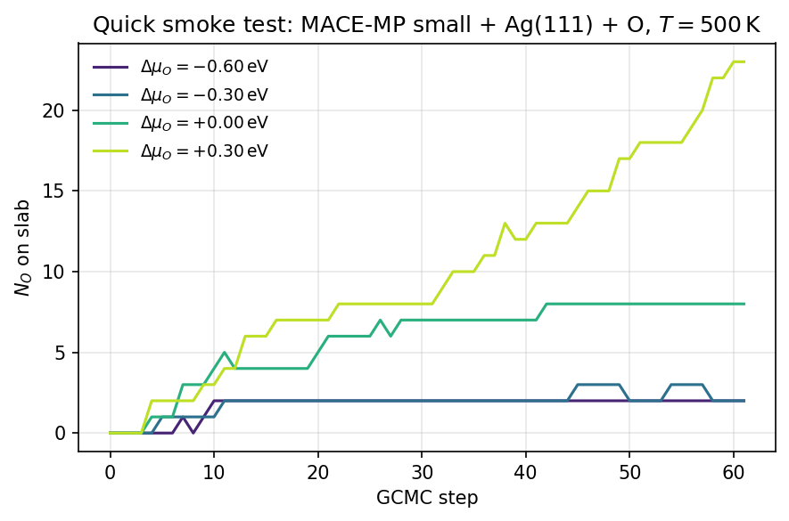

Minimal GCMC on an Ag(111) slab
===============================

Shortest possible GCMC example using only EMT, suitable for a quick smoke
test of the install. For a calibrated MLIP-based run see
:doc:`../getting_started`.

Goal
----

Run 500 GCMC steps of oxygen insertion/deletion on a clean Ag(111) slab at
:math:`T = 500\,\mathrm{K}` and :math:`\mu_{\mathrm{O}} = -0.2\,\mathrm{eV}`,
using EMT so it runs anywhere without GPUs or MACE checkpoints.

.. note::

   EMT is **only** for plumbing tests — its O–Ag interaction is not
   physical. Swap in MACE (or any ASE calculator) for production.
   EMT also has its own energy scale: adsorbing one O changes the energy by
   only about :math:`-0.05` eV, so :math:`\mu_{\mathrm{O}}` must sit near
   that value. An MLIP-scale chemical potential such as :math:`-5` eV never
   accepts an insertion on EMT.

Code
----

.. code-block:: python

   import numpy as np
   from ase.build import fcc111
   from ase.calculators.emt import EMT
   from ase.constraints import FixAtoms

   from mcpy.calculators import BaseCalculator
   from mcpy.cell import CustomCell
   from mcpy.ensembles.grand_canonical_ensemble import GrandCanonicalEnsemble
   from mcpy.moves import InsertionMove, DeletionMove
   from mcpy.moves.move_selector import MoveSelector

   atoms = fcc111('Ag', a=4.085, size=(3, 3, 3), vacuum=8.0, periodic=True)
   atoms.set_constraint(FixAtoms(indices=[a.index for a in atoms if a.tag == 3]))

   cell = CustomCell(
       atoms,
       custom_height=5.0,
       bottom_z=atoms.positions[:, 2].max() + 0.5,
       species_radii={'Ag': 2.75, 'O': 0.0},
   )

   # BaseCalculator wraps an ASE calculator with LBFGS pre-relaxation,
   # which is the hybrid-GCMC workflow used throughout mcpy.
   calculator = BaseCalculator(calculator=EMT(), steps=20, fmax=0.1)

   ss = np.random.SeedSequence(0)
   s1, s2 = (int(x) for x in ss.generate_state(2, dtype=np.uint32))
   moves = MoveSelector(
       [1, 1],
       [InsertionMove(cell, species=['O'], min_insert=0.5, seed=s1),
        DeletionMove(cell, species=['O'], seed=s2)],
   )

   gcmc = GrandCanonicalEnsemble(
       atoms=atoms,
       cells=[cell],
       calculator=calculator,
       mu={'O': -0.2},
       units_type='metal',
       species=['O'],
       temperature=500.0,
       move_selector=moves,
       outfile='gcmc_demo.out',
       traj_file='gcmc_demo.xyz',
   )
   gcmc.run(steps=500)

Outputs
-------

- ``gcmc_demo.out`` — step log with per-move acceptance ratios.
- ``gcmc_demo.xyz`` — extended XYZ trajectory; each frame's comment line
  carries ``energy=`` and ``Lattice=``.

What the trajectory looks like
------------------------------

Running the same setup with a MACE-MP small foundation model (in place
of EMT) over four :math:`\Delta\mu_O` values produces the following
coverage trace — each line follows :math:`N_O` on the slab as a function
of GCMC step:

   N\ :sub:`O` vs GCMC step at four :math:`\Delta\mu_O` values, Ag(111)
   3×3×3, :math:`T = 500\,\mathrm{K}`. More oxidizing conditions (yellow)
   drive higher coverage; reducing conditions (purple) keep the slab
   nearly clean.

The four trajectories can be concatenated and fed into the phase-diagram
analyzer — see :doc:`phase_diagram_analysis`.

Next steps
----------

- Replace EMT with a MACE checkpoint and sweep :math:`\mu_{\mathrm{O}}` to
  build a phase diagram: see :doc:`../getting_started`.
