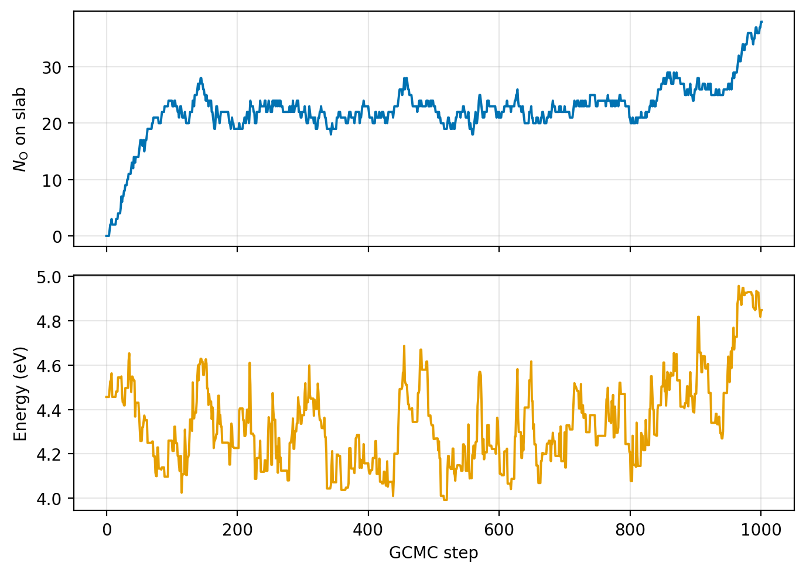
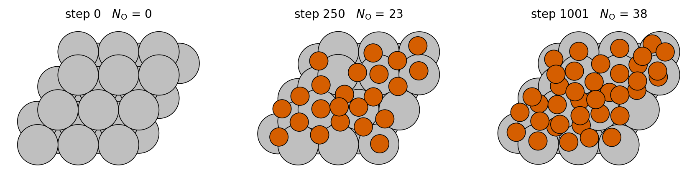

From a clean slab to an oxidation phase diagram
================================================

This tutorial builds a surface oxidation phase diagram.
Starting from a clean Ag(111) slab, you will run grand-canonical Monte Carlo
(GCMC) at a series of oxygen chemical potentials and turn the results into a
figure that shows which oxide coverages are stable under which conditions.
Every intermediate output is inspected along the way, so you can tell a
healthy run from a broken one before committing real compute.

GCMC samples the compositions the reservoir conditions favour.
You fix the temperature and the oxygen chemical potential, and the simulation
inserts and deletes oxygen atoms until the surface reaches the coverage those
conditions dictate.
That equilibrium coverage, swept across chemical potentials, is the phase
diagram.

.. contents::
   :local:
   :depth: 1

1. Installing mcpy and checking the setup
-----------------------------------------

mcpy installs from the repository.
The ``mcpy`` name on PyPI belongs to an unrelated macro library, so clone and
install from source (details in :doc:`installation`).

The ``mace`` extra installs the MLIP backend.
This tutorial evaluates energies with a MACE foundation model, and the extra
pulls in ``mace-torch`` together with the packages the bundled examples use.

An import check confirms the install.

.. code-block:: bash

   git clone https://github.com/farrisric/mcpy.git
   cd mcpy
   pip install -e .[mace]
   python -c "import mcpy; print('mcpy', mcpy.__version__)"

2. Building the slab and marking where oxygen can go
-----------------------------------------------------

Build the substrate
~~~~~~~~~~~~~~~~~~~

The starting configuration is a plain ASE ``Atoms`` object.
Anything you can build with ASE can seed a run, and here ``fcc111`` gives a
4x4x3 Ag slab with 8 Å of vacuum.

``FixAtoms`` anchors the bottom layer.
Trial moves are followed by a short relaxation, and without the constraint
the whole slab would drift with every accepted move instead of representing a
semi-infinite crystal.

Mark the insertion window
~~~~~~~~~~~~~~~~~~~~~~~~~

The ``CustomCell`` defines the insertion window.
It spans the full width of the box but only a 5 Å slice starting above the
top Ag layer, so every proposed oxygen lands near the surface instead of
somewhere in the vacuum.

``species_radii`` feeds the free-volume estimate.
The cell measures how much of its window is not already occupied by atoms,
counting a point as occupied when it falls within the given radius of an atom
of that element, and that free volume enters the GCMC acceptance rule
directly.

These radii deserve calibration before production runs.
The values below are sane for O on Ag, and :doc:`species_radii` shows how to
derive them for your own potential and system.

.. figure:: _static/fig_free_volume.png
   :alt: The insertion window above the slab with sample points classified as free or occupied.
   :width: 85%
   :align: center

   The ``CustomCell`` window above the slab (2D schematic). The cell samples
   random points in the shaded window and classifies each one against the
   exclusion radii; only the free fraction counts toward
   :math:`V_{\mathrm{free}}`.

.. code-block:: python

   from ase.build import fcc111
   from ase.constraints import FixAtoms

   from mcpy.cell import CustomCell

   atoms = fcc111('Ag', a=4.085, size=(4, 4, 3), vacuum=8.0, periodic=True)
   bottom = [a.index for a in atoms if a.tag == 3]
   atoms.set_constraint(FixAtoms(indices=bottom))

   cell = CustomCell(
       atoms,
       custom_height=5.0,
       bottom_z=atoms.positions[:, 2].max() + 0.5,
       species_radii={'Ag': 2.75, 'O': 0.0},
       mc_sample_points=100_000,
   )

3. Choosing the trial moves
---------------------------

Composition changes need an insertion move and a deletion move.
``InsertionMove`` places a new O atom at a random point in the cell,
rejecting draws that land within ``min_insert`` of an existing atom, and
``DeletionMove`` removes a random O atom from inside the cell.
Together they let the oxygen count fluctuate, which is the defining feature
of the grand-canonical ensemble.

``MoveSelector`` draws one move per step.
The weights are relative frequencies, so ``[1, 1]`` attempts insertions and
deletions equally often, and the selector reports a separate acceptance ratio
for each move in the log.

Explicit seeds make runs reproducible.
Each move owns its random-number generator, and deriving both seeds from one
``SeedSequence`` means a single integer reproduces the entire run.

.. code-block:: python

   import numpy as np

   from mcpy.moves import InsertionMove, DeletionMove
   from mcpy.moves.move_selector import MoveSelector

   ss = np.random.SeedSequence(42)
   s1, s2 = (int(x) for x in ss.generate_state(2, dtype=np.uint32))

   moves = MoveSelector(
       [1, 1],
       [InsertionMove(cell, species=['O'], min_insert=0.5, seed=s1),
        DeletionMove(cell, species=['O'], seed=s2)],
   )

4. Wiring a calculator that relaxes each trial
----------------------------------------------

``MACE_F_Calculator`` relaxes each trial structure.
It wraps a MACE model in a short LBFGS geometry optimization, and the energy
handed to the acceptance rule is the relaxed one.

Raw insertions land far from real bonding sites.
A random point in the free volume typically sits a fraction of an angstrom
off the nearest hollow site, and evaluated as placed it carries a repulsive
energy that would reject nearly every insertion.
Relaxing first lets acceptance reflect the chemistry of the nearby minimum
instead of the luck of the draw, which is what makes GCMC workable on a dense
metal surface (see :doc:`calculators` for the full story).

``steps`` and ``fmax`` cap the relaxation budget.
Forty optimizer steps to a loose 0.1 eV/Å tolerance is enough to absorb the
placement noise, and a Monte Carlo run spends its budget better on more
trials than on converging each one to machine precision.

.. code-block:: python

   from mcpy.calculators import MACE_F_Calculator

   calculator = MACE_F_Calculator(
       model_paths='mace_mp_medium.model',   # your local MACE checkpoint
       steps=40,
       fmax=0.1,
       device='cuda',
   )

5. Running GCMC at one chemical potential
-----------------------------------------

Reference the chemical potential
~~~~~~~~~~~~~~~~~~~~~~~~~~~~~~~~

The oxygen chemical potential references the O\ :sub:`2` molecule.
The reservoir in an oxidation experiment is O\ :sub:`2` gas, so the natural
zero for one adsorbed O atom is half the energy of an O\ :sub:`2` molecule
computed with the same calculator.

:math:`\Delta\mu` expresses the environmental conditions.
Values below zero correspond to oxygen-poor conditions such as high
temperature or low pressure, and values near zero to oxygen-rich ones.
Here a single condition at :math:`\Delta\mu = -0.3` eV serves as the test
run before the sweep.

Assemble and run
~~~~~~~~~~~~~~~~

``GrandCanonicalEnsemble`` ties every ingredient together.
It draws a move from the selector each step, evaluates the relaxed trial
energy, applies the grand-canonical acceptance rule at the given ``mu`` and
``temperature``, and commits or rolls back the configuration.

The write intervals control the two output files.
Every accepted configuration goes to the trajectory, while the log gets one
line every ten steps to stay readable.
Expect the first step to be slower than the rest, since the model loads and
the cell samples its free volume once up front.

.. code-block:: python

   from ase.build import molecule

   from mcpy.ensembles.grand_canonical_ensemble import GrandCanonicalEnsemble

   o2 = molecule('O2', cell=[12.0] * 3)
   e_o2 = calculator.get_potential_energy(o2)

   gcmc = GrandCanonicalEnsemble(
       atoms=atoms,
       cells=[cell],
       calculator=calculator,
       mu={'O': e_o2 / 2 - 0.3},     # half the O2 energy plus Delta mu = -0.3 eV
       units_type='metal',
       species=['O'],
       temperature=500.0,
       move_selector=moves,
       outfile='gcmc.out',
       traj_file='gcmc.xyz',
       outfile_write_interval=10,
       trajectory_write_interval=1,
   )
   gcmc.run(steps=1000)

Read the outputs
~~~~~~~~~~~~~~~~

The log tracks particle count, energy, and acceptance ratios.
Each line carries the step index, the current atom count, the current
energy, and the acceptance ratio of every move since the previous line, in
the move order spelled out in the header.

.. code-block:: text

   Step       N_atoms    Energy (eV)     Acceptance Ratios (Ins, Del)
   -----------------------------------------------------------------
   0          48         -157.210000     N/A, N/A
   10         51         -160.830000     40.0%, 0.0%
   ...
   1000       58         -168.120000     25.5%, 12.0%

The trajectory opens directly in ASE.
Frames are extended XYZ with the energy and lattice on the comment line, so
``ase.io.read`` recovers everything the analysis below needs.

Convergence shows as a plateau in the oxygen count.
Plot the count against the frame index, and treat the run as equilibrated
only after the curve levels off and fluctuates around a steady value.

Unbalanced acceptance ratios signal an unconverged run.
While coverage is still climbing, insertions far outpace deletions, and in
the steady state the two ratios settle to comparable values.
A persistent imbalance after the count has flattened points at
mis-calibrated exclusion radii instead.

.. code-block:: python

   from ase.io import read

   traj = read('gcmc.xyz', index=':')
   n_oxygen = [sum(a.symbol == 'O' for a in frame) for frame in traj]
   # plot n_oxygen vs frame index: it should plateau in the second half

   What a healthy run looks like: a 1000-step EMT demo of this exact setup
   (:math:`\mu_{\mathrm{O}} = -0.2` eV on EMT's shallow O-Ag energy scale,
   generated by ``docs/make_figures.py``). The oxygen count climbs from the
   clean slab, then fluctuates around a steady coverage; the late rise past
   step 900 is the onset of second-layer growth under this toy potential.

   Trajectory snapshots from the same run (top view, O in orange): the clean
   starting slab, the equilibrated coverage, and the crowded late-run state.

6. Sweeping the chemical potential
----------------------------------

One run samples one environmental condition.
The phase diagram needs the equilibrium answer at several chemical
potentials, and each one is an independent GCMC run that can execute in
sequence or in parallel.

A function parameterised on :math:`\Delta\mu` drives the sweep.
The body repeats sections 2 through 5 unchanged, so only the chemical
potential and the output paths vary between conditions.

Each condition writes into its own directory.
Condition-tagged paths keep the sweep restartable and make the collection
step below a one-liner.

The early frames belong to equilibration.
Every run starts from the same clean slab, so the first stretch of each
trajectory records the climb toward equilibrium rather than samples of it,
and the analysis will drop those frames.

.. code-block:: python

   from pathlib import Path

   def run_gcmc(delta_mu, steps=1000, seed=42):
       outdir = Path(f'sweep/dmu_{delta_mu:+.2f}')
       outdir.mkdir(parents=True, exist_ok=True)
       # rebuild atoms, cell, moves, and calculator exactly as in
       # sections 2-4, seeded per condition
       ...
       gcmc = GrandCanonicalEnsemble(
           ...,
           mu={'O': e_o2 / 2 + delta_mu},
           outfile=str(outdir / 'gcmc.out'),
           traj_file=str(outdir / 'gcmc.xyz'),
       )
       gcmc.run(steps=steps)

   for delta_mu in (-0.8, -0.6, -0.4, -0.2, 0.0):
       run_gcmc(delta_mu)

7. Assembling the phase diagram
-------------------------------

Collect the frames
~~~~~~~~~~~~~~~~~~

The sweep trajectories are the input.
:func:`mcpy.utils.phase_diagram.plot_phase_diagram` accepts a list of
trajectories and flattens them, so passing one production slice per
condition is enough.

The clean slab serves as the reference.
Formation energies are measured against the lowest-energy oxygen-free frame
in the input, and since the production slices start after equilibration,
frame 0 of one run is kept to guarantee a clean reference exists.

Draw the diagram
~~~~~~~~~~~~~~~~

``plot_phase_diagram`` computes the surface formation energy per frame.
For every frame it evaluates the formation energy as a function of
:math:`\Delta\mu` from the frame's energy and oxygen count, normalised by
the surface area.

The lower envelope marks the stable phases.
At each :math:`\Delta\mu` the frame with the lowest formation energy wins,
and the winning stretches partition the axis into the stable coverages.

The ``transitions`` array locates the phase boundaries.
Each entry is the :math:`\Delta\mu` where the envelope switches from one
structure to the next, and a twin axis converts the range into O\ :sub:`2`
pressures at the given temperature.

Thumbnails show one structure per stable phase.
The figure renders the winning configuration of each stretch above the
envelope, so the diagram reads as structures, not curve indices.
:doc:`phase_diagrams` covers every knob, including nanoparticle
normalisation and molecular adsorbates.

.. code-block:: python

   from ase.io import read

   from mcpy.utils.phase_diagram import plot_phase_diagram

   # The lowest-energy O-free frame is the reference, so keep frame 0
   # (the clean slab) even though the equilibration frames are dropped.
   clean = read('sweep/dmu_-0.80/gcmc.xyz', index='0')

   frames = [clean] + [
       read(f'sweep/dmu_{dmu:+.2f}/gcmc.xyz', index='500:')   # drop equilibration
       for dmu in (-0.8, -0.6, -0.4, -0.2, 0.0)
   ]

   results = plot_phase_diagram(
       frames,
       adsorbate='O',
       metal_symbols=('Ag',),
       mu_ref=e_o2 / 2,
       kind='surface',
       T=500.0,
       dmu_range=(-1.0, 0.0),
       outfile='phase_diagram.png',
   )
   print(results['transitions'])   # Delta mu values of the phase boundaries

.. figure:: _static/fig_phase_diagram_ag_o.png
   :alt: Surface phase diagram of O on Ag(111).
   :width: 75%
   :align: center

   A real O/Ag(111) diagram produced this way with a MACE potential (from
   the executed phase-diagram notebook). Grey lines are individual frames,
   the thick line is the stable envelope, and the shading marks the stable
   phases; the top axis converts :math:`\Delta\mu_{\mathrm{O}}` into
   O\ :sub:`2` pressure at 500 K.

8. Where to go next
-------------------

Production runs need calibrated exclusion radii.
:doc:`species_radii` derives them from relaxed insertion trials with your
own potential.

Molecular adsorbates exchange whole molecules with the reservoir.
:doc:`molecular_adsorbates` covers rigid insertion, deletion, and
displacement of species such as CO and O\ :sub:`2`.

Replica exchange runs every condition in parallel.
:doc:`ensembles` describes the MPI and single-GPU batched variants, either
of which can replace the sequential loop of section 6.

Other cells fit nanoparticles and supported particles.
:doc:`cells` maps each geometry to its cell type, from periodic boxes to
spheres and domes.

The notebooks repeat these workflows with executed output.
The :doc:`notebooks page <notebooks>` lists them, from GCMC basics to the
CO/CuPd replica-exchange study, with every cell already run.
