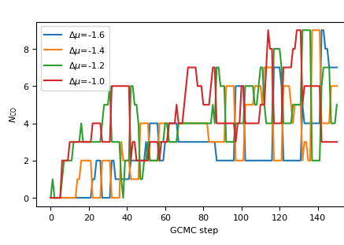

Simulating molecular adsorbates
===============================

Molecular moves exchange whole molecules such as CO, O\ :sub:`2`, or
H\ :sub:`2`\ O with the reservoir instead of single atoms.
Read this page when your adsorbate is a molecule, when you need to set a
molecular chemical potential, or when atomic and molecular species share one
simulation.

How it works
------------

**Molecules move as rigid bodies.**
The insertion proposal places the template at a random position with a
uniform random orientation, and the displacement proposal translates and
rotates a molecule without bending it.
With a relaxing calculator the molecule still relaxes after placement, so
the rigid template is a starting point, not a frozen geometry.

**mu means the full molecular chemical potential.**
Orientations are proposed uniformly, which absorbs the rotational partition
function into the chemical potential rather than into the acceptance rule.
Compute the molecule's energy in a box with your production calculator and
pass ``mu = E(molecule) + delta_mu``, where ``delta_mu`` carries the
translational, rotational, and pressure contributions of the reference
reservoir.

**Acceptance counts molecules of the exchanged species.**
The combinatorial :math:`N` in the insertion and deletion rules is the
number of molecules of that species with center of mass inside the move's
cell, and the de Broglie wavelength comes from the total molecular mass.
This is the textbook rigid-molecule convention and matches LAMMPS
``fix gcmc``.
Atomic moves keep mcpy's historical total-atom-count convention, and the two
coexist in one run.
:doc:`gcmc_acceptance_convention` records why the conventions differ.

**A per-atom molecule_id array tracks membership.**
Every atom carries an integer id, with members of one molecule sharing a
value and free atoms carrying ``-1``.
Deletion removes a whole id group, and the array shrinks with the structure,
so membership never drifts out of sync with the atom list.

**Rollback restores the bookkeeping.**
The ensembles restore all per-atom arrays when a trial is rejected, and
``molecule_id`` is such an array, so a rejected molecular trial leaves the
bookkeeping bit-identical to before the proposal.

**Trajectories carry molecule_id for restarts.**
The extended-XYZ writer declares the array in ``Properties=``, so
``ase.io.read`` recovers it.
A molecular run restarted from its own trajectory resumes with intact
molecule membership instead of a heap of anonymous atoms.

**Atomic and molecular species can coexist.**
An atomic insertion tags its new atom as free explicitly, because ASE's
array extension would otherwise zero-fill the id and silently attach the
atom to molecule 0.
An atomic deletion draws only from free atoms and never dismembers a
molecule.
This enables mixed reservoirs, for example dissociative O at half the
O\ :sub:`2` chemical potential alongside molecular O\ :sub:`2`.
One caveat remains: the atomic displacement-type moves are not
molecule-aware and can drag a single member atom, which a relaxing
calculator tolerates but the rigid-molecule picture does not.

**An optional angle cap tames the rotation proposal.**
A full uniform rotation is the correct default for a physisorbed molecule,
but for a strongly anchored one it proposes flips the surface always
rejects.
Measured on CO on a CuPd nanoparticle, capping the angle raised displacement
acceptance from 5 percent to 42 percent and roughly halved the steps to
convergence.
The capped proposal stays symmetric, so no acceptance correction is needed.

**BatchedReplicaExchange is the replica-exchange path.**
The MPI :class:`ReplicaExchange` counts species by chemical symbol, which is
always zero for a molecular name, so its constructor raises
``NotImplementedError`` rather than silently accepting every swap.
The batched variant counts molecules in its grand-potential bookkeeping and
is the supported way to run molecular ladders.

API walkthrough
---------------

Registering a molecular species
~~~~~~~~~~~~~~~~~~~~~~~~~~~~~~~

``GrandCanonicalEnsemble(..., mu={'CO': e_co - 0.65}, molecules={'CO': co_template}, species=[])``
   The ``molecules`` dict maps each species name to its ASE template.
   The name is the key you use in ``mu`` and pass to the molecular moves,
   and it must not collide with an element symbol already present as an
   atomic species.
   Leave ``species`` empty when every exchanged species is molecular.

``SetUnits(unit_type, temperature, species, molecules=None)``
   Computes the per-species de Broglie wavelengths, using the total
   molecular mass for molecular entries.
   Built automatically by the ensemble.
   It rejects two templates with identical compositions, because the
   id-based bookkeeping cannot tell isomers apart.

Exchanging molecules with the reservoir
~~~~~~~~~~~~~~~~~~~~~~~~~~~~~~~~~~~~~~~

``MoleculeInsertionMove(cell, molecule, name, seed, min_insert=None, max_molecules=None)``
   Inserts the template rigidly at a random position and orientation drawn
   from the cell.
   The template is centered on its center of mass at construction, and the
   whole molecule is appended in one step with a fresh ``molecule_id``.
   ``min_insert`` retries the draw until every new atom clears that distance
   from the existing structure, which spares the calculator from evaluating
   hopeless overlaps.
   ``max_molecules`` skips the trial once the population reaches a cap.

``MoleculeDeletionMove(cell, molecule, name, seed, min_molecules=None)``
   Deletes one molecule of the species, drawn uniformly among those whose
   center of mass lies inside the cell.
   Reports a failed proposal when no candidate exists or when
   ``min_molecules`` would be violated, and failed proposals stay out of the
   acceptance statistics.

Moving adsorbed molecules between sites
~~~~~~~~~~~~~~~~~~~~~~~~~~~~~~~~~~~~~~~

``MoleculeDisplacementMove(cell, molecule, name, seed, max_displacement=0.5, max_angle=None)``
   Translates one molecule's center of mass by a random vector inside a
   sphere of radius ``max_displacement``, then rotates it about the
   displaced center.
   Both parts are symmetric proposals, so the move runs under the plain
   Metropolis rule.
   A displacement that would carry the center of mass out of the cell is
   rejected, because a molecule outside the region would silently leave the
   grand-canonical bookkeeping.
   Set ``max_angle`` (radians) for anchored adsorbates such as CO, and leave
   the full rotation for physisorbed ones.

Inspecting molecules in a configuration
~~~~~~~~~~~~~~~~~~~~~~~~~~~~~~~~~~~~~~~

``find_molecules(atoms, template_symbols, cell=None)``
   Returns the member-index groups of every molecule matching the template
   composition, optionally filtered to centers of mass inside a cell.
   Useful for counting coverage per frame when post-processing a trajectory.

``molecule_com(atoms, members)``
   Returns the center of mass of one member group.

``random_rotation_matrix(rng)``
   Draws a rotation uniformly over orientations, the same generator the
   insertion and displacement proposals use.

Worked examples
---------------

   Molecular GCMC in motion: :math:`N_{\mathrm{CO}}` on a CuPd nanoparticle
   against GCMC step, one trace per :math:`\Delta\mu` rung of a batched
   replica-exchange ladder (from the executed CO/CuPd notebook). More
   CO-rich conditions settle at higher coverage.

.. figure:: _static/fig_phase_diagram_co_cupd.png
   :alt: Phase diagram of CO on a CuPd nanoparticle with structure thumbnails.
   :width: 100%
   :align: center

   The resulting phase diagram: stable (CO)\ :sub:`n` phases of the
   Cu\ :sub:`33`\ Pd\ :sub:`5` particle against the CO chemical potential
   (see :doc:`phase_diagrams`).

- ``examples/gcmc_molecule_mace.py`` adsorbs any ASE-buildable molecule on
  Ag(111) with MACE.
- ``examples/re_gcmc_co_cupd_batched.py`` runs CO on a CuPd nanoparticle
  across a mu ladder with batched replica exchange.
- The molecular GCMC notebook walks the machinery step by step with executed
  output (see :doc:`notebooks`).
