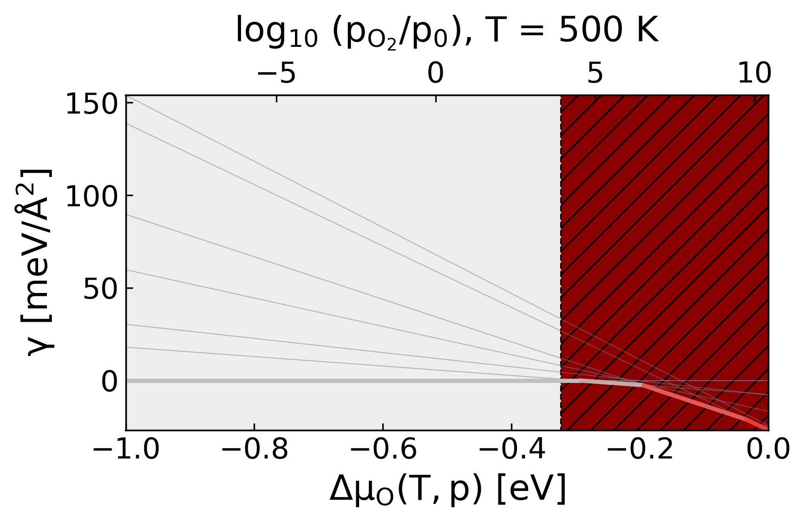
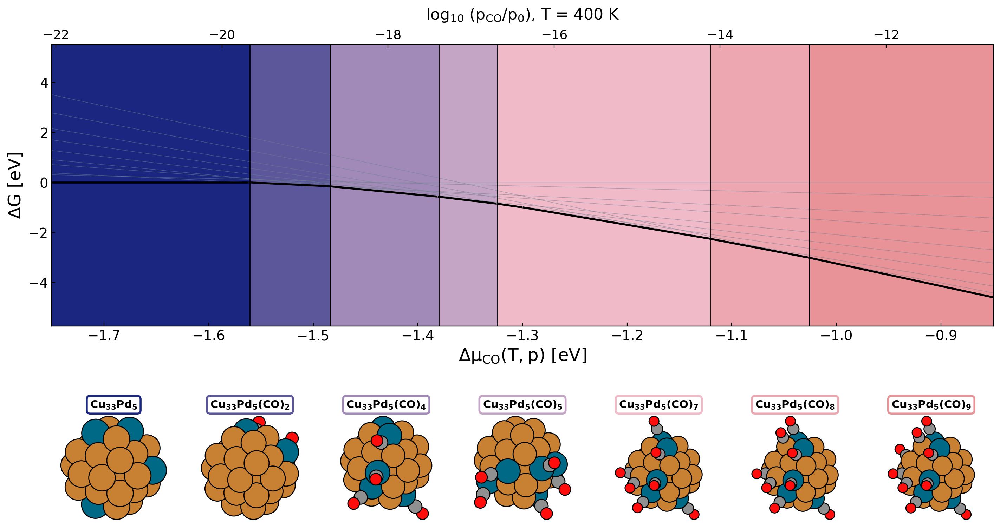

Building phase diagrams from GCMC output
========================================

A phase diagram turns the trajectories of a chemical-potential sweep into a
stability map with phase boundaries.
Raw GCMC energies are not comparable across conditions, because each run
trades energy against particle count at its own :math:`\mu`.
The formation energy puts every frame on one axis, and its lower envelope
answers the question the sweep was run for: which coverage is stable where.
Read this page after any :math:`\mu` sweep, for surface slabs and
nanoparticles alike.

   A surface diagram (O on Ag(111), MACE): per-frame formation-energy lines
   in grey, the stable envelope highlighted, phases shaded, and the O\
   :sub:`2` pressure at 500 K on the top axis.

How it works
------------

**Each frame maps to a line in Delta mu.**
For a frame with energy :math:`E` and :math:`n` adsorbate atoms, the
formation energy relative to the clean reference is
:math:`E - E_{\mathrm{ref}} - n\,(\mu_{\mathrm{ref}} + \Delta\mu)`.
Every frame therefore contributes a straight line in :math:`\Delta\mu` with
slope :math:`-n`.
Steeper lines are higher coverages, and where the lines cross, the preferred
coverage changes.

**The lower envelope defines stability.**
At each point of a :math:`\Delta\mu` grid, the frame with the lowest
formation energy is the thermodynamically stable one.
The winning stretches partition the axis into phases, and the crossings
between winners are the phase boundaries the function reports.

**The clean frame anchors the reference.**
The lowest-energy adsorbate-free frame in the input becomes
:math:`E_{\mathrm{ref}}`, so the whole diagram is self-contained.
The function raises an error when no adsorbate-free frame is present, so
keep the starting configuration of one run in the input even after dropping
equilibration.

**Trajectories supply the candidate structures.**
The diagram is built from every production frame rather than from a
hand-picked set.
Frames written by mcpy carry their energy on the comment line, and the
function reads it back without re-evaluating anything.

**Surface and nanoparticle runs normalise differently.**
``kind='surface'`` divides by the in-plane cell area and reports meV/Ų,
the convention for surface Gibbs energies.
``kind='nano'`` divides by the metal-atom count and reports meV/atom, which
keeps particles of different sizes comparable.
``gamma_in_ev=True`` skips the normalisation when you want raw formation
energies.

**A twin axis translates Delta mu into pressure.**
:math:`\Delta\mu` maps to a gas pressure through
:math:`k_B T \ln(p/p_0)`, so the top axis shows :math:`\log_{10}(p/p_0)` at
the given temperature.
The same diagram then reads in both languages, the theorist's chemical
potential and the experimentalist's pressure.

**Molecular adsorbates change the pressure exponent.**
The default assumes a dissociative diatomic reservoir, where one gas
molecule delivers two adsorbed atoms and
:math:`\mu_{\mathrm{atom}} = \mu_{\mathrm{gas}}/2`.
For molecular adsorbates such as CO the reservoir molecule is the adsorbed
unit itself, so pass ``atoms_per_reservoir_molecule=1`` to keep the pressure
axis honest.

**Narrow phases merge below a width threshold.**
Two nearly degenerate frames can alternate as the winner over a sliver of
:math:`\Delta\mu`, which would clutter the diagram with phases no experiment
could resolve.
Stretches narrower than ``min_phase_width`` merge into their neighbours.

API walkthrough
---------------

Building the diagram from frames
~~~~~~~~~~~~~~~~~~~~~~~~~~~~~~~~

``plot_phase_diagram(frames, adsorbate='O', metal_symbols=('Ag',), mu_ref=-4.93, kind='surface', T=500.0, dmu_range=(-1.0, 0.0), n_bins=400, min_phase_width=0.03, outfile=None, ...)``
   Computes the formation-energy envelope over an ``n_bins`` grid across
   ``dmu_range`` and renders the figure.
   ``frames`` takes a flat list of ``Atoms`` or a list of trajectories and
   flattens them.
   ``mu_ref`` is the adsorbate reference on your calculator's energy scale,
   for example half the O\ :sub:`2` energy.
   The returned dict carries the grid (``dmu_grid``), the per-frame lines
   (``free``), the envelope (``min_gamma``), the winning frame indices
   (``stable_idx``, ``phase_order``), and the boundary positions
   (``transitions``).
   Structure thumbnails of each stable phase render above the envelope
   unless ``show_structures=False``.

Counting adsorbates that share a symbol
~~~~~~~~~~~~~~~~~~~~~~~~~~~~~~~~~~~~~~~

``plot_phase_diagram(..., adsorbate_count_fn=my_count, adsorbate_label='O')``
   By default the adsorbate count is the number of atoms with the matching
   symbol, which over-counts when the same element also sits in an inert
   sublattice, for example O adsorbed on a particle supported by an oxide.
   ``adsorbate_count_fn`` receives each frame and returns the count that
   defines the stoichiometry, while the full frame still renders in the
   thumbnails.
   ``adsorbate_label`` sets the species name in the axis labels when the
   counted symbol is a proxy.

Labelling molecular reservoirs
~~~~~~~~~~~~~~~~~~~~~~~~~~~~~~

``plot_phase_diagram(..., adsorbate='CO', atoms_per_reservoir_molecule=1)``
   Sets the reservoir stoichiometry used by the pressure axis, as described
   under the design decisions.
   The molecule-aware thumbnail labels follow, so a phase reads as
   (CO)\ :sub:`4` rather than C\ :sub:`4`\ O\ :sub:`4`.

Legacy trajectory-file workflow
~~~~~~~~~~~~~~~~~~~~~~~~~~~~~~~

``analyze_phase_diagram_results(trajectory_path, host_symbol, oxygen_symbol, idx_ref, ...)``
   The older oxidation-specific entry point.
   Reads one concatenated trajectory from disk, takes the reference frame by
   index, and works against tabulated host and oxide reference energies.
   Prefer ``plot_phase_diagram`` for new work, and reach for this one when
   reproducing results built on its conventions.

Worked examples
---------------

   A molecular nanoparticle diagram (CO on Cu\ :sub:`33`\ Pd\ :sub:`5`,
   ``kind='nano'``, ``atoms_per_reservoir_molecule=1``): the thumbnails name
   each stable phase by its (CO)\ :sub:`n` count, and the top axis reads in
   CO pressure at 400 K.

- Section 7 of :doc:`getting_started` builds the O/Ag(111) diagram.
- The phase-diagram notebook builds a diagram interactively with executed
  output (see :doc:`notebooks`).
- The CO/CuPd replica-exchange notebook ends in a molecular (CO)
  nanoparticle diagram with ``kind='nano'``.
