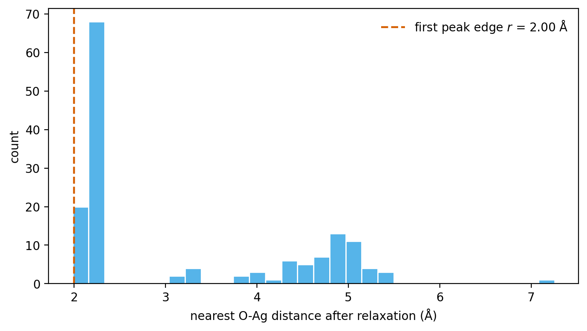

Calibrating `species_radii`
===========================

`species_radii` is the element-wise dictionary that controls how the free-volume Monte Carlo
estimator decides whether a sampled point is occupied. Because :math:`V_{\mathrm{free}}` enters
the GCMC insertion and deletion acceptance terms directly (see :ref:`free-volume`), the
quality of these radii is a sensitive input -- not a tuning knob to leave at default values.

The exclusion radius for a host species should reflect the **shortest adsorbate-host distance
that survives a local relaxation** with the calculator used in production (the thesis behind
this library denotes it :math:`r_{\mathrm{relax}}`). Every value of `species_radii` is tied to
the specific calculator and relaxation settings used during production; re-calibrate if either
changes.

Free-volume estimate (recap)
----------------------------

For completeness, the estimator used by every cell object in `mcpy` is:

.. math::

   I_k =
   \begin{cases}
   1, & \exists\, a\ \text{such that}\ \|\mathbf{x}_k-\mathbf{r}_a\|^2 \le r_{\mathrm{species}(a)}^2,\\
   0, & \text{otherwise,}
   \end{cases}
   \qquad
   V_{\mathrm{free}} = V_{\mathrm{cell}}\,\bigl(1 - \tfrac{1}{N_{\mathrm{MC}}}\textstyle\sum_k I_k\bigr).

See :ref:`free-volume` for the role of :math:`V_{\mathrm{free}}` in the GCMC acceptance terms.

.. figure:: _static/fig_free_volume.png
   :alt: Sample points in a slab window classified as free or occupied.
   :width: 85%
   :align: center

   The estimator at work in a ``CustomCell`` window over an Ag(111) slab
   (2D schematic). Each random point (dots) is classified against the
   exclusion disks of radius :math:`r_{\mathrm{Ag}}` (dotted circles); the
   free fraction of the window sets :math:`V_{\mathrm{free}}`.

Measure the radius from relaxed insertions
------------------------------------------

Drop a trial adsorbate at random positions above the surface, relax each trial with your
production calculator, and record the nearest adsorbate-host distance that survives:

.. code-block:: python

   import numpy as np
   from ase.build import fcc111
   from ase.constraints import FixAtoms
   from ase.optimize import LBFGS

   rng = np.random.default_rng(11)
   slab0 = fcc111('Ag', a=4.085, size=(3, 3, 3), vacuum=8.0, periodic=True)
   z_top = slab0.positions[:, 2].max()

   distances = []
   for _ in range(150):
       slab = slab0.copy()
       slab.set_constraint(FixAtoms(indices=[a.index for a in slab if a.tag == 3]))
       slab.append('O')
       slab.positions[-1] = [rng.uniform(0, slab.cell[0, 0]),
                             rng.uniform(0, slab.cell[1, 1]),
                             z_top + rng.uniform(1.0, 3.5)]
       slab.calc = calculator          # your production calculator
       LBFGS(slab, logfile=None).run(fmax=0.1, steps=50)
       d = slab.get_distances(len(slab) - 1, range(len(slab) - 1), mic=True)
       distances.append(d.min())

   r_relax = np.percentile(distances, 5)   # edge of the first peak

   The histogram this loop produces (O on Ag(111); EMT stands in for the
   production calculator, generated by ``docs/make_figures.py``). The sharp
   first peak collects the chemisorbed outcomes; its lower edge is
   :math:`r_{\mathrm{relax}}`.

The far cluster of large distances comes from trials that relaxed away without binding --
ignore it and read off the lower edge of the first peak.
``scripts/compute_radii.py`` packages this loop for FCC(111) hosts with a MACE model.

Use the value in a simulation
-----------------------------

Put the measured pair distance on the host species and zero on the adsorbate (or split it
equally between the two -- either convention works if used consistently):

.. code-block:: python

   cell = CustomCell(
       atoms,
       custom_height=5.0,
       bottom_z=atoms.positions[:, 2].max() + 0.5,
       species_radii={'Ag': r_relax, 'O': 0.0},
   )

Validate with a short pilot run before production: the insertion acceptance ratio and the
reported :math:`V_{\mathrm{free}}` should both be stable and non-degenerate.
