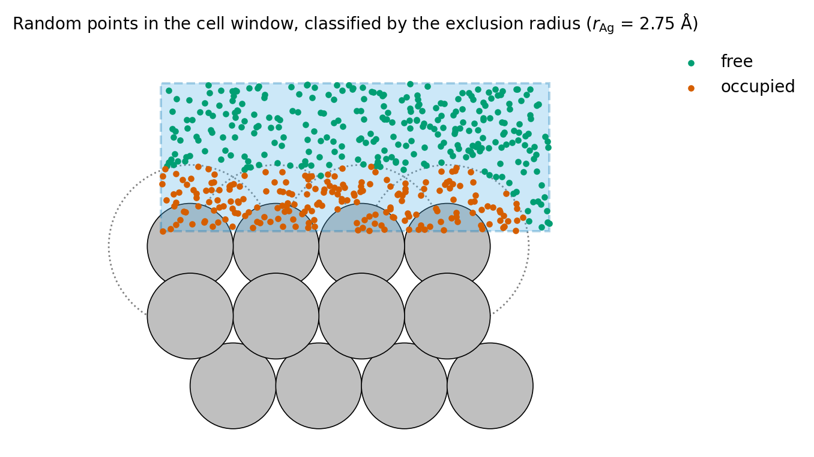

Calibrating `species_radii`
===========================

`species_radii` is the element-wise dictionary that controls how the free-volume Monte Carlo
estimator decides whether a sampled point is occupied. Because :math:`V_{\mathrm{free}}` enters
the GCMC insertion and deletion acceptance terms directly (see :ref:`free-volume`), the
quality of these radii is a sensitive input -- not a tuning knob to leave at default values.

This page describes how to choose them in a reproducible way.

Idea
----

The exclusion radius for a host species should reflect the **shortest adsorbate-host distance
that survives a local relaxation** with the calculator used in production. In the thesis
that motivates this library, this radius is denoted :math:`r_{\mathrm{relax}}` and is
identified as the position of the first maximum in the radial distribution function (RDF) of
the adsorbate around host atoms, taken over an ensemble of relaxed insertion trials.

In other words: every value of `species_radii` should be tied to the specific
calculator and relaxation settings used during production. Re-calibrate if either changes.

Free-volume estimate (recap)
----------------------------

For completeness, the estimator used by every cell object in `mcpy` is:

.. math::

   I_k =
   \begin{cases}
   1, & \exists\, a\ \text{such that}\ \|\mathbf{x}_k-\mathbf{r}_a\|^2 \le r_{\mathrm{species}(a)}^2,\\
   0, & \text{otherwise,}
   \end{cases}
   \qquad
   V_{\mathrm{free}} = V_{\mathrm{cell}}\,\bigl(1 - \tfrac{1}{N_{\mathrm{MC}}}\textstyle\sum_k I_k\bigr).

See :ref:`free-volume` for the role of :math:`V_{\mathrm{free}}` in the GCMC acceptance terms.

   The estimator at work in a ``CustomCell`` window over an Ag(111) slab
   (2D schematic). Each random point (dots) is classified against the
   exclusion disks of radius :math:`r_{\mathrm{Ag}}` (dotted circles); the
   free fraction of the window sets :math:`V_{\mathrm{free}}`.

The insertion region itself is chosen to focus sampling on chemically relevant volumes:

- **Surface slabs** -- a sub-region spanning the full :math:`(x, y)` extent of the cell and
  a finite thickness along :math:`z` (e.g. ~5.5 Å) covering the topmost atomic layer and a
  thin vacuum gap.
- **Nanoparticles** -- a sphere centred on the particle, with a small vacuum margin
  (e.g. ~3 Å) between the outermost atom and the boundary so insertions stay close to the
  surface.

Reference workflow: O on Ag
---------------------------

For oxygen insertions on silver surfaces the recommended workflow is:

1. Build representative Ag slabs covering the facets and coverages relevant to your study.
2. Place a single O atom at many candidate sites (top, bridge, hollow, plus randomised
   lateral positions and heights).
3. Relax each structure with the *same* calculator and convergence settings used in
   production.
4. For every relaxed structure, record the nearest O-Ag distance.
5. Aggregate the distribution and read off a conservative minimum stable O-Ag distance --
   for example, the first peak of the RDF or the lower edge of its dominant mode.

The resulting distance defines the O/Ag exclusion scale used in `species_radii`.

Mapping pair distances to element-wise radii
--------------------------------------------

`species_radii` stores per-element radii, while the measurement above produces a *pair*
distance. Either of the following conventions is used in the reference application; just be
consistent across a project:

- **All on the host species** -- put the full pair distance on the host and zero on the
  adsorbate. For O on Ag::

      species_radii = {"Ag": d_min_O_Ag, "O": 0.0}

- **Split between species** -- divide the pair distance equally::

      species_radii = {"Ag": 0.5 * d_min_O_Ag, "O": 0.5 * d_min_O_Ag}

Regardless of choice, validate the calibration with a short pilot run before launching
production: monitor the insertion-move acceptance ratio and the reported
:math:`V_{\mathrm{free}}` -- both should be stable and non-degenerate.

Automated calibration with `compute_radii.py`
---------------------------------------------

The script `scripts/compute_radii.py` automates the workflow above for FCC(111) hosts:

- builds a periodic FCC(111) slab of the chosen metal,
- repeatedly inserts a trial atom into a `CustomCell` placed over the surface,
- relaxes each insertion with the supplied MACE model,
- records the nearest-neighbour distance before and after relaxation,
- saves the distance pairs and writes a histogram/KDE plot for visual inspection.

Inputs
~~~~~~

- a path to a trained MACE model (passed as the single command-line argument).

Outputs (one set per inserted species)
~~~~~~~~~~~~~~~~~~~~~~~~~~~~~~~~~~~~~~

- ``<species>_distances.npy`` -- pairs of ``(d_insertion, d_relaxed)`` nearest-neighbour
  distances.
- ``dist_hist.png`` -- histogram and KDE of the relaxed distances, used to pick a
  conservative exclusion distance.
- ``insertion.log`` -- progress and per-trial diagnostics.

Configuration
~~~~~~~~~~~~~

Edit the top of `compute_radii.py` to match your system before running:

- `metal_species` (e.g. `"Ag"`),
- `gas_species` (e.g. `"O"`),
- `lattice_param`,
- `cell_bottom`, `cell_height` -- defines the rectangular insertion sub-slab,
- `n_trials`,
- `relax_max_steps`, `relax_fmax` -- relaxation convergence.

Run
~~~

.. code-block:: bash

   python scripts/compute_radii.py /path/to/your_mace_model.model

Interpretation
~~~~~~~~~~~~~~

Inspect ``<species>_distances.npy`` and ``dist_hist.png``. Identify the first peak of the
relaxed distribution -- that is your :math:`r_{\mathrm{relax}}`. Then translate it into
element-wise radii using one of the conventions above:

.. code-block:: python

   species_radii = {"Ag": d_min_O_Ag, "O": 0.0}

The same script and procedure apply to other host/adsorbate pairs by changing
`metal_species` and `gas_species`.
